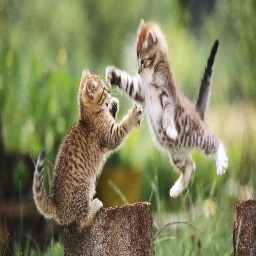

# IUST Security Course

## Image Cryptography

### Steganography
steganography is the process of hiding a message inside a photo. The message could be image or text. In this project I implemented both text and image hiding. It will hide the message in LSB(Least Significant Bit) of image in a consecutive way. So that putting this LSB next to each other will form a meaningful message. The fantastic part of it is that the image doesn't change at all because modifying LSB has the least effect in display of an image.
For text extracting I also implemented meaningfulness of a text. this operation was done based on english dictionary.

- main image after hiding

- extracted image

### Watermarking
Implemented fragile watermarking in a way that put logo on the corner of an image.

## Wiener Attack On RSA
Wiener attack on RSA can be done under certain conditions. The condition is if a private key is smaller than some factor of N, an attacker can retreive private key easily. The process of Wiener attack on RSA is implemented in this project [reference](https://sagi.io/crypto-classics-wieners-rsa-attack/).

## Attacks On RSA
Two attack on RSA were simulated
- chosen cipher text attack : which is using brute force for every plain text with some calculation which leads to encrypted message
- factorization : unbreakability of RSA algorithm is that factorization of N is a NP hard problem and can't be factorized easily but if N is small we can factor N in polynominal time. this Implementation simulates this type of attack. 